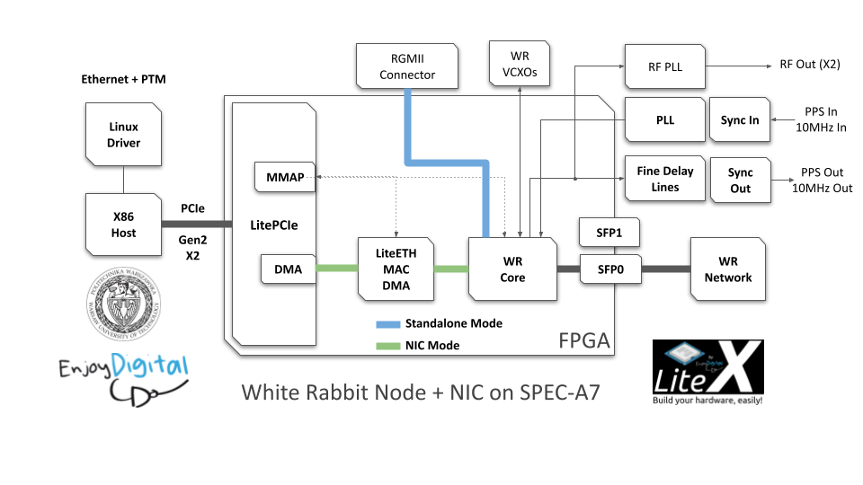
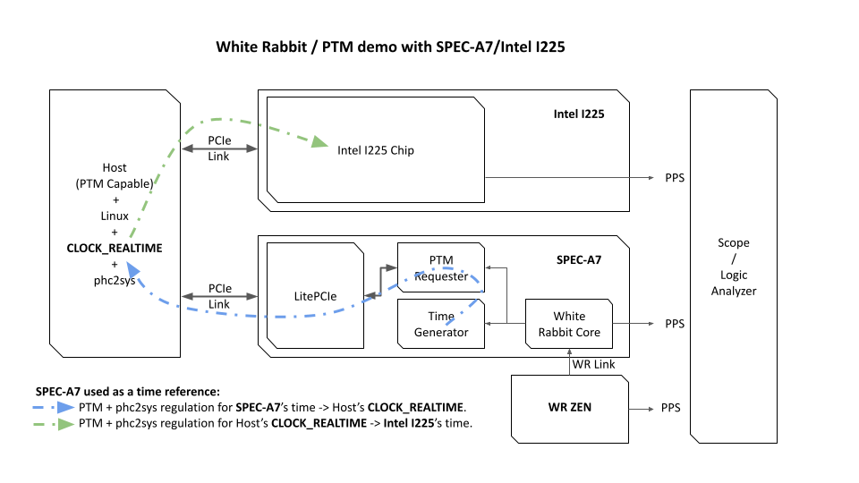

```
                           __   _ __      _  __   _      _____      _  ___________
                          / /  (_) /____ | |/_/__| | /| / / _ \____/ |/ /  _/ ___/
                         / /__/ / __/ -_)>  </___/ |/ |/ / , _/___/    // // /__
                        /____/_/\__/\__/_/|_|    |__/|__/_/|_|   /_/|_/___/\___/
                        LiteX based White Rabbit PCIe NIC with PTM support.
                        Copyright (c) 2024 Warsaw University of Technology
                              Copyright (c) 2012-2024 Enjoy-Digital
```


[> Intro
--------

This project implements a LiteX-based White Rabbit NIC, combining networking and synchronization
features with support for PCIe Precision Time Measurement (PTM). The design enables White Rabbit
(WR) synchronization to be propagated to the host and other PTM-compatible systems while providing
1Gbps Ethernet functionality.

### Key Features

- **White Rabbit Synchronization:** Sub-nanosecond timing precision, integrated WR fabric interface,
    and support for PPS/10MHz clock outputs.

- **PCIe PTM Integration:** Propagates WR clock to the host system and connected boards via PCIe
    PTM. This ensures precise time distribution across systems.

- **LitePCIe:** Provides the foundation for PCIe integration, including MMAP, DMA for NIC
    functionality, and PTM TLP handling.

- **LiteEth-based Ethernet NIC:** Offers a 1Gbps Ethernet interface with Linux driver support.

### Supported Boards

- **SPEC-A7:** Includes advanced clocking features like external 10MHz input and fine delay lines
    for precise PPS/10MHz generation from WR network.

- **LiteX Acorn Baseboard:** Features a larger FPGA (XC7A200T) for easier debugging. Future plans
    aim to add digital VCXO functionality for full White Rabbit support.

This open-source project is modular and developer-friendly, making it suitable for applications
requiring precise timing and basic networking functionality.



[> Prerequisites / System setup
-------------------------------

These are required in order to build and use the FPGA design and associated software provided in
this project:
- Linux computer, PTM capable (Tested with Ubuntu 22.04.4 LTS).
- Python3, Xilinx Vivado installed.
- LiteX [installed]
  (https://github.com/enjoy-digital/litex/wiki/Installation#litex-installation-guide) and up to
  date.
- A LiteX-Acorn-Baseboard Mini.
- An Intel I225 board.
- A JTAG-HS2 Cable.
- A Logic Analyzer/Scope to observe PPS.

[>  White Rabbit / PTM Demonstration with SPEC-A7 and Intel I225
----------------------------------------------------------------

In this section, we demonstrate the integration of White Rabbit (WR) synchronization with PCIe
Precision Time Measurement (PTM) using the SPEC-A7 board as a bridge between WR and PCIe systems.
The experiment validates the propagation of precise timing across a WR network, a PTM-capable host
system, and an Intel I225 Ethernet controller, with all devices generating synchronized PPS
signals.

### Experiment Setup

The setup involves the components and connections illustrated in the diagram below:



1. **White Rabbit ZEN (WR Master):**
   - Acts as the timing reference, generating a precise PPS signal and distributing WR timing over a
     WR link.

2. **SPEC-A7 (WR Slave):**
   - Synchronizes to the WR ZEN via the WR protocol.
   - Outputs a PPS signal generated from WR timing for direct observation.
   - Propagates WR timing to the host system via PCIe PTM.

3. **Host System (PTM Capable):**
   - Synchronizes its `CLOCK_REALTIME` to the WR clock using `phc2sys` and PCIe PTM.
   - Regulates its clock and propagates the synchronized timing to the Intel I225 controller via
     PCIe PTM and `phc2sys`.

4. **Intel I225 Controller:**
   - Receives timing information from the host system via PCIe PTM.
   - Synchronizes its internal clock using `phc2sys` and generates a PPS signal for direct
     observation.

5. **Observation:**
   - The PPS signals from the WR ZEN, SPEC-A7, and Intel I225 are observed using an oscilloscope or
     logic analyzer to ensure alignment.

### Results

The experiment confirmed correct White Rabbit synchronization and PCIe PTM functionality:

- The PPS signals from the WR ZEN, SPEC-A7, and Intel I225 are aligned.
- No noticeable drift was observed between the three PPS signals over time, demonstrating successful
  propagation of precise WR timing across all systems.
- The use of `phc2sys` ensured accurate regulation of both the host system's `CLOCK_REALTIME` and
  the Intel I225's internal clock.

This result validates the SPEC-A7's capability to bridge WR and PCIe PTM systems, providing precise
synchronization to hosts and downstream devices.

### Run the PTM/Intel I225 PPS Demo

Follow these steps to reproduce the demonstration:

#### On WR Zen (used here as WR Master):
```sh
# Set WR date to match the Host date.
wr_date set host
```

#### On PCIe Host:
```sh
cd software

# Enable PPS generation on Intel I225/SPD0 pin.
cd ./intel_i225_pps.py --enable

# Start phc2sys regulation from Host -> Intel I225.
sudo phc2sys -s CLOCK_REALTIME -c /dev/ptp0 -O 0 -m

# Start phc2sys regulation from SPEC-A7 -> Host.
sudo phc2sys -c CLOCK_REALTIME -s /dev/ptp3 -O 0 -m
```

### Observing the Results

- Use an oscilloscope or logic analyzer to monitor the PPS signals from:
  1. The WR ZEN (reference timing source).
  2. The SPEC-A7 board.
  3. The Intel I225 Ethernet controller.

- Confirm that the three PPS signals are aligned and do not drift over time.

These steps validate the proper integration of White Rabbit and PCIe PTM for precise time
synchronization across devices.

[> Build and test White Rabbit NIC design
-----------------------------------------

The FPGA design can be build and tested with the following commands:

```sh
$ ./acorn_wr_nic.py --build --load or
$ ./spec_a7_wr_nic.py --build --load
```

The WR console/gui should then be available on `/dev/ttyUSB2`:

```
wrc# gui

CLB3 WRPC Monitor wrpc-v5.0-9-g5ac04dd5 | Esc/q = exit; r = redraw

TAI Time: 1970-01-01-00:06:32  UTC offset: 0    PLL mode: BC  state: Locking
---+-------------------+-------------------------+---------+---------+-----
 # |        MAC        |       IP (source)       |    RX   |    TX   | VLAN
---+-------------------+-------------------------+---------+---------+-----
 0 | 22:33:44:55:66:77 |                         |       7 |     195 |    0

--- HAL ---|------------- PPSI ------------------------------------------------
 Itf | Frq |  Config   | MAC of peer port  |    PTP/EXT/PDETECT States   | Pro
-----+-----+-----------+-------------------+-----------------------------+-----
 wr0 |     | auto      | 00:00:00:00:00:00 | LISTENING/IDLE      /WA_MSG | R-W
Pro(tocol): R-RawEth, V-VLAN, U-UDP

--------------------------- Synchronization status ----------------------------
Link down, master mode or sync info not valid
```

The board should be should be able to communicate with another WR equipment and timing corrections
displayed even if not effective on the LiteX-Acorn-Baseboard-Mini.

When rebooting the Host PC, the board should also be enumerated and seen with `lspci` with PTM
capabilities.

TODO: Finish WR Fabric Interface <-> NIC to WR NIC functionnality.
TODO: Describe PTM tests.

[> Build and test LiteEth 1000BaseX NIC design
----------------------------------------------

The FPGA design can be build and tested with the following commands:

```sh
$ ./acorn_liteeth_nic.py --build --load or
$ ./spec_a7_liteeth_nic.py --build --load
```

When rebooting the Host PC, the board should also be enumerated and seen with `lspci`.

The PCIe NIC driver can then be loaded:
```sh
cd software/driver
make clean all
sudo init.sh
```

The board can then be used as a Linux NIC and tested with tools like iperf3 ex:

Server (without the board):
```
iperf3 -s
```

Client (with the board):
```
iperf3 -c 192.168.1.122 -B 192.168.1.92
iperf3 -c 192.168.1.122 -B 192.168.1.92 -R
```

Note: Adapt the IP addresses to your network configuration.


[> Build the WR RISC-V firmware
-------------------------------

The WR Core includes a RISC-V CPU running a firmware that controls peripherals and provides
diagnostics through the WRC console. This section explains how to rebuild and reload the firmware
onto the CPU using the tools and scripts provided in this project.

**Build the Firmware**

To rebuild the firmware, use the following commands:

```sh
cd firmware
./build.py
```

The build.py script compiles the firmware using a specific RISC-V toolchain as recommended in the WRPC User Manual ([Section 2.2]
(https://ohwr.org/project/wr-cores/wikis/uploads/7cf8d2161b6e5fa86348455bbd022196/wrpc-user-manual-v5.0.pdf)).
If the toolchain is not already installed, build.py will automatically download and use it.


**Reload the Firmware**

The LiteX server is required to establish a remote connection to the Etherbone bus. To start the server over a UDP connection, use:

```sh
litex_server --udp
```

With the LiteX server running, navigate to the test directory and use the test_wb_cpu.py script to load the new firmware onto the CPU.

```sh
cd test
./test_wb_cpu.py --build-firmware --load-firmware ../firmware/wrpc-sw/wrc.bin
```

This command will:
- Build the firmware if --build-firmware is specified.
- Load the firmware from the specified path onto the CPU.

The script will display a progress bar while loading the firmware, like this:

```sh
Loading firmware from ../firmware/wrpc-sw/wrc.bin...
Loading firmware: 100%|██████████████████████████████████| 30270/30270 [00:00<00:00,
```

[> Use LiteX Server/LiteScope
-----------------------------

LiteX Server:
```sh
litex_server --jtag --jtag-config=openocd_xc7_ft4232.cfg
```

LiteScope:
```
litescope_cli --subsampling=16384
```

[> SDB
------

see **wrpc-user-manual-v5.0.pdf** and *wrpc-sw/tools/sdbfs.README*

A file must be stored into the SPI flash with parameters (cal, sfp, ...).

in *wrpc-sw* (after having build firmware):

```bash
./tools/gensdbfs -b 65536 tools/sdbfs-flash /tmp/sdb-wrpc.bin
```

*SDBFS* update/rewrite:
```
wrc# sfp erase
wrc# sfp add AXGE-1254-0531 180750 148326 1235332 333756144
wrc# sfp add AXGE-3454-0531 180750 148326 -1235332 333756144
```
