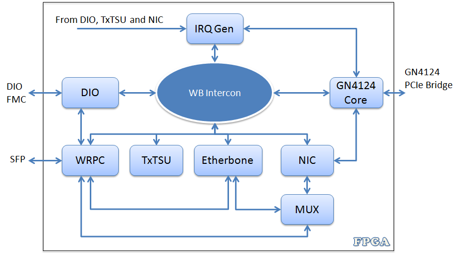

*wr-nic* demonstration/gateware for SPEC board is available at
*https://ohwr.org/project/wr-nic*.

This gateware as shown in figure:



contains the module wr-nic. This one is instanciated directly by the top level
file (*hdl/top/nic/nic_top.vhd*) by:

```
cmp_nic_wrapper : wr_nic_wrapper
    generic map(
      g_num_irqs  => 1,
      g_num_ports => 1
      )
    port map(
      clk_sys_i                 => clk_sys_62m5,
      resetn_i                  => rst_sys_62m5_n,
      ext_slave_i               => cnx_slave_in(c_WB_SLAVE_NIC),
      ext_slave_o               => cnx_slave_out(c_WB_SLAVE_NIC),
      nic_snk_i                 => wrc_wrf_src_out,
      nic_snk_o                 => wrc_wrf_src_in,
      nic_src_i                 => wrc_wrf_snk_out,
      nic_src_o                 => wrc_wrf_snk_in,
      pps_p_i                   => wrc_pps_csync_out_ext,
      pps_valid_i               => wrc_pps_valid_out_ext,
      vic_irqs_i                => (others => '0'),
      vic_int_o                 => vic_irq,
      txtsu_timestamps_i(0)     => wrc_timestamps_out,
      txtsu_timestamps_ack_o(0) => wrc_timestamps_ack_in);

```

This repository also contains the driver, but this is not enough to have a working interface.
The driver is registered at ethernet level but requires another driver to be probed.

## 10G-wr-nic

Another [project](https://ohwr.org/project/10G-wr-nic) is dedicated to have a network interface with WR support

No issues to build the bitstream, some fixes for drivers (as usual). But once
the bitstream loaded and a `sudo modprobe spec` a dmesg indicates an error:
```
[    3.156754] spec-fmc-carrier 0000:01:00.0: enabling device (0000 -> 0002)
[    3.191221] spec-fmc-carrier spec-0000:01:00.0: Application not found
```

## Prerequisites

### Gateware
Official way requires `hdlmake` to generates `Makefile`

```bash
git clone https://ohwr.org/project/hdl-make.git

cd hdl-make

# by the past master branch was broken
git checkout origin/develop -b develop

pip3 install --user -e .

```

## Repository

Both gateware and software are present in the same repo:

```bash
# No recursive here: some submodules have wrong URL
git clone https://ohwr.org/project/wr-nic.git
cd wr-nic

# required because master is old and fixes are present
# with recent kernel
git checkout 28c5db8b96a7bca8effda3db14f9c3898c0aaac5
# Now it's possible to fetch gitmodules
# but recursive is not working (broken link again:-/ )
git submodule update --init
```

Software part needs few patches to be compatible with recent kernel.
An useful tool to deal with multiples patches is `quilt` (`apt install quilt`).

## Gateware

```bash
cd wr-nic/syn/nic
hdlmake
make
```

And it's fails due to missing/wrong xilinx IPs.

```
Checking expanded design ...
ERROR:NgdBuild:604 - logical block
   'cmp_gn4124_core/cmp_l2p_dma_master/cmp_data_fifo' with type 'l2p_fifo' could
   not be resolved. A pin name misspelling can cause this, a missing edif or ngc
   file, case mismatch between the block name and the edif or ngc file name, or
   the misspelling of a type name. Symbol 'l2p_fifo' is not supported in target
   'spartan6'.
ERROR:NgdBuild:604 - logical block
   'cmp_gn4124_core/cmp_l2p_dma_master/cmp_addr_fifo' with type 'l2p_fifo' could
   not be resolved. A pin name misspelling can cause this, a missing edif or ngc
   file, case mismatch between the block name and the edif or ngc file name, or
   the misspelling of a type name. Symbol 'l2p_fifo' is not supported in target
   'spartan6'.

```

This is concern
*wr-nic/hdl/ip_cores/gn4124-core/hdl/gn4124core/rtl/l2p_dma_master.vhd*

By adding:
```
echo 'xfile add ../../ip_cores/gn4124-core/hdl/spec/ip_cores/l2p_fifo.ngc' >> $@
```

after `hdlmake` step and before `make` the bitstream is correctly builded

## Software

As mentionned, *wr-nic* repository provides a driver but this one is also
available in *spec-sw*. Latest repository seems obsolete and try to load
directly a bitstream at start time. Best way seems for the low level aspect to use
*spec* repository (by using *ohwr-build-scripts* to avoid dependencies
complexity).

Unfortunately after building all drivers:
```
sudo modprobe spec-fmc-carrier
```

fails with (dmesg):
```
[ 6954.470893] fpga_manager fpga0: fpga_mgr_unregister gn412x-fcl.2.auto
[ 6956.141100] FPGA manager framework
[ 6956.196808] gpio gpiochip0: (gn412x-gpio): not an immutable chip, please
consider fixing it!
[ 6956.197700] fpga_manager fpga0: gn412x-fcl.2.auto registered
[ 6956.214478] spec-fmc-carrier 0000:01:00.0: Expected Little Endian devices
BOM: 0x78010000
[ 6956.214530] spec-fmc-carrier 0000:01:00.0: FPGA incorrectly programmed or
empty (-22)
```

see [this line](https://ohwr.org/project/spec/blob/master/software/kernel/spec-core-fpga.c#L1168)

with:
- `#define SPEC_META_BOM_LE 0xFFFE0000`
- `#define SPEC_META_BOM_END_MASK 0xFFFF0000`

## Try2

Based on `spec` repository for golden bitstream and `wr-starting-kit` for
drivers part

### spec repository

Note: *ise* must be in `PATH`

```bash
git clone https://ohwr.org/project/spec.git
cd spec
git submodule update --init
cd hdl/syn/golden-45T
hdlmake
make

sudo mkdir -p /lib/firmware/fmc
sudo cp spec_golden.bin /lib/firmware/fmc/spec-init.bin
```


## Software

Before trying to build wr-nic driver *fmc-bus* driver must be present

## FMC-BUS repos

```bash
git clone https://ohwr.org/project/fmc-bus.git
cd fmc-bus
quilt import /somewhere/white_rabbit_wut_tests/wr-nic/patches/fmc-bus/*.patch
quilt push -a
# build
make
sudo make install
```

kernel/software part is located in *sw* sub-directory. Latest commits has for
goal to fix build with kernel 5.15. First step is to apply to custom patches to
fix build with kernel > 5.15.

```bash
cd wr-nic
quilt import /somewhere/white_rabbit_wut_tests/wr-nic/patches/wr-nic/*.patch
quilt push -a
```

It's now possible to built/install drivers with:
```bash
cd wr-nic/sw
FMC_BUS_ABS=/somewhere/fmc-bus make
sudo make install
```
